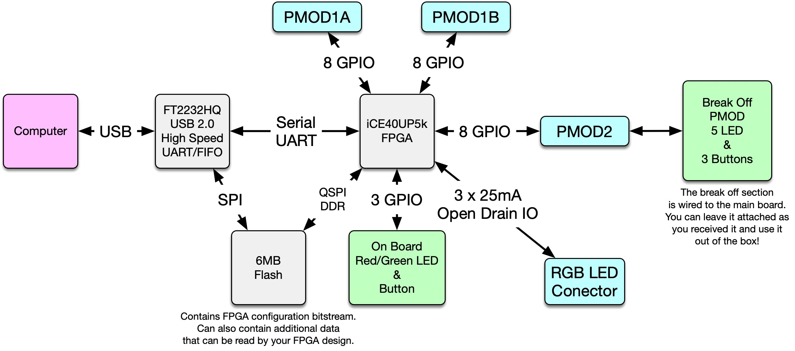
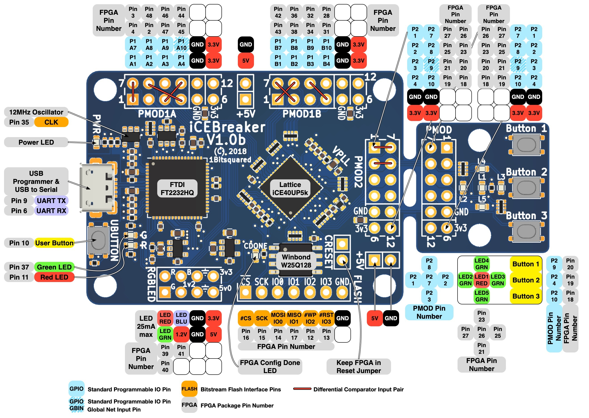
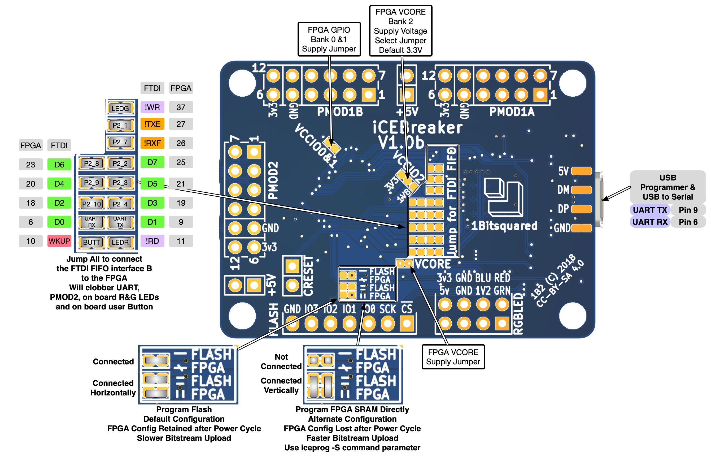

# ICEBreaker FPGA

 

The iCEBreaker FPGA board is a low cost, open-source educational FPGA
development board.

The main motivating application of this board is for classes and workshops
teaching the use of the open source FPGA design flow using
[Yosys](http://www.clifford.at/yosys/),
[nextpnr](https://github.com/YosysHQ/nextpnr),
[icestorm](http://www.clifford.at/icestorm/),
[iverilog](http://iverilog.icarus.com/),
[symbiflow](https://github.com/SymbiFlow) and others. This means the board has
to be low cost and have a nice set of features to allow for the design of
interesting classes and workshop exercises. At the same time we want to allow
the user to use the proprietary vendor tools if they choose to. Because of that
we need to be compatible with their firmware upload tools.

# Hardware Specifications

* iCE40UP5K in QFN48 (SG48) package
  * [iCE40 UltraPlus 5K](http://www.latticesemi.com/-/media/LatticeSemi/Documents/DataSheets/iCE/iCE40-UltraPlus-Family-Data-Sheet.ashx)
  * 5280 Logic Cells (4-LUT + Carry + FF)
  * 128 KBit Dual-Port Block RAM
  * 1 MBit (128 KB) Single-Port RAM
  * PLL, Two SPI and two I2C hard IPs
  * Two internal oscillators (10 kHz and 48 MHz)
  * 8 DSPs (16x16 multiply + 32 bit accumulate)
  * 3x 24mA drive and 3x hard PWM IP

* QSPI-DDR-capable flash 128 MBit (16 MB)
  * We selected to use the Winbond
    [W25Q128JVSIM](http://www.winbond.com/resource-files/w25q128jv_dtr%20revc%2003272018%20plus.pdf)
  * We want to enable projects that access the flash and we want to provide the
    highest flash access speed possible.

* [FT2232H](http://www.ftdichip.com/Support/Documents/DataSheets/ICs/DS_FT2232H.pdf) interface (microUSB plug)
  * programming compatible with iCEstick and HX8K board
    * works with [Dimond Programmer](http://www.latticesemi.com/programmer) and
      [iceprog](https://github.com/cliffordwolf/icestorm/tree/master/iceprog)
  * serial port compatible with iCEstick and HX8K breakout board
  * 12 MHz XTAL oscillator (shared with FPGA)
  * Solder jumpers to offer direct SRAM programming (like on HX8K breakout board)

* 39 I/O capable pins:
  * 4 pins for config (SDI, SDO, SCK, CSB)
    * Either loading config from on board FLASH chip or provided through the
      FTDI chip with direct SRAM config.
  * 2 extra GPIO pins for QSPI
    * Together with the config pins, allows storage of additional data in the
      FLASH chip, and high speed QSPI DDR access. For example
      [picosoc](https://github.com/cliffordwolf/picorv32/tree/master/picosoc)
      firmware.
  * 3 PINs for RGB LED (pin header)
  * 2 LEDs (one on output-only PLL pin)
  * 1 Clock pin (on PLL GBIN)
  * 1 UART Rx Pin via FTDI
  * 1 UART Tx Pin via FTDI
  * 1 Push Button
  * 16 PINs on dual PMOD
  * 8 PINs on single PMOD / snap-off section

* Support for FTDI Async FIFO mode
  * We want to support FTDI Async mode via some (unpopulated by default) zero
    ohm resistors
  * This shares 8 GPIOs with the single PMOD / snap-off section
  * This would also enable use of full list of RS232 signals
  * BDATA[0] -- Tx on FTDI / Rx on FPGA (always connected, no zohm resistor
    required)
  * BDATA[1] -- Rx on FTDI / Tx on FPGA (always connected, no zohm resistor
    required)
  * BDATA[7:2] -- Shared with snap-off section (via zohm resistor footprint)
  * RX Full -- Shared with snap-off section (via zohm resistor footprint)
  * TX Empty -- Shared with snap-off section (via zohm resistor footprint)
  * Read -- Shared with LED 1 (via zohm resistor footprint, LED used as RX
    indicator)
  * Write -- Shared with LED 2 (via zohm resistor footprint, LED used as TX
    indicator)
  * WakeUp -- Shared with Push Button (via zohm resistor footprint)
  * This configuration uses the following pins when the jumpers ore reconfigured:
    * The two on board red and green LED pins
    * The on board user button pin
    * snap off section single PMOD pins 

* Snap-off section (convertible to PMOD host / PMOD device)
  * 5 LEDs in similar arrangement to iCEstick
  * 3 Push Buttons

* Other stuff
  * Status LEDs for Power and CDONE
  * Header with supply rails: 5V, 3V3, 1V2, GND
  * Debug header for all 6 QSPI pins
  * Test points for UART Rx / Tx signals
  * Jumpers or zohm resistors on all rails for measuring currents
  * Four 3mm mounting holes on the main section and two more on the snap-off
    section
  * The two LEDs on the main section should be wired "active low" so they work 
    well as indicator LEDs for FIFO read/write.
  * The five LEDs on the snap-off section should be wired "active high"
  * A zohm resistor for Bank 2 supply so that the IO voltage can be changed. Use
    Bank 2 for one of the ports on the double PMOD.
  * There should be auxilary 5V pin headers available for the PMODs. Some PMOD
    need either higher voltage or need to regulate their own voltage from 5V.

* Unpopulated parts shipped with the board
  * 3x Host PMOD (2x for dual PMOD port, 1x for snap-off section)
  * 1x Device PMOD (for other side of snap-off section)

**iCEBreaker block diagram**  

**iCEBreaker V1.0b pinout legend**  

**iCEBreaker V1.0b jumper legend**  

* Branding
  * iCEbreaker (https://twitter.com/AboveVacant/status/948323920595308545)
