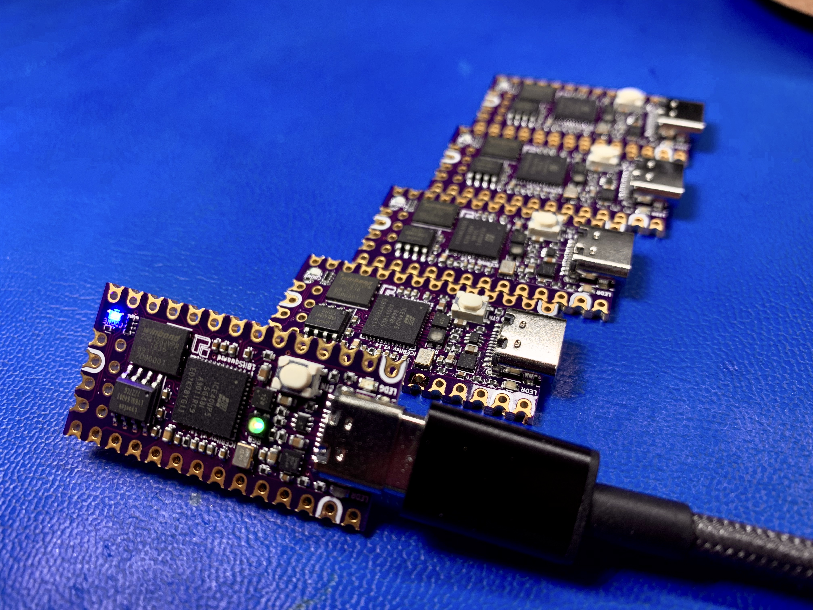

# iCEBreaker Bitsy v1.1b

[Available at 1BitSquared](//1bitsquared.com/collections/fpga/products/icebreaker-bitsy)

iCEBreaker Bitsy is the smaller but just-as-capable sibling to iCEBreaker. At just 36x18mm, it is compatible with the Teensy form-factor and can be easily embedded into any project.

## Features
  
* iCE40UP5K in QFN48 (SG48) package
  * PLL, two SPI and two I2C hard IPs
* 128M (16MiB) DDR- and QPI-capable Flash Memory
* 64M (8MiB) QPI-capable Pseudo-SRAM
* USB-C interface (comes preloaded with a [RISC-V soft-core USB bootloader](//github.com/no2fpga/no2bootloader))
* RGB LED connected to 3x 24mA hard PWM IP pins
* Two user LEDs (one shared with RAM-CS)
* Status LED for CDONE
* 12MHz external clock (on PLL GBIN)
* One user button
* Supply rails: 3.3V and 1.2V
* FPGA SPI/programming header
  * 4 pins for config (SDI, SDO, SCK, CS)
  * 2 extra GPIO pins for QSPI/QPI
  * CDONE, CRESET, 3.3V, and GND
* Teensy form-factor compatible
* Compatible with Feather ecosystem using a [Teensy 3.x Feather Adapter](//adafruit.com/product/3200)
* Castellated edges and single-side-load for easy module integration

## Changelog

### v1.1b (2020-10-19)

* Changed board dimensions to metric instead of imperial (36x18mm)
* Added top-side silkscreen labels
* Enlarged USB-C solder paste openings

### v1.1a (2020-08-05)

* Switched to WSON 6x5mm flash to accommodate through-hole programming header
* Improved silkscreen

### v1.0a (2020-06-10)

* Complete redesign
* Pinout/dimensions now Teensy-compatible
* Moved Pseudo-SRAM to the top, populate it by default
