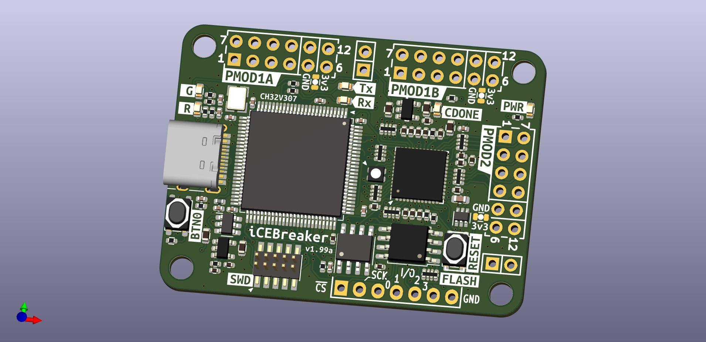

# iCEBreaker FPGA v1.99a

The iCEBreaker FPGA board is a low cost, open-source educational FPGA
development board. 

This version v1.99a is a development/alpha board to evaluate a possible FTDI replacement MCU the CH32V307.

